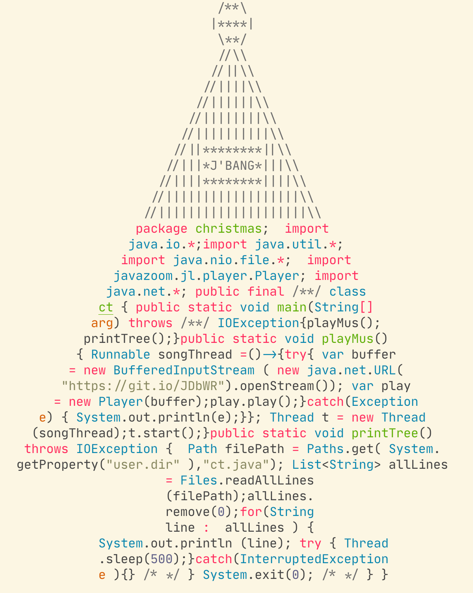

## Christmas Tree



### Introduction

This repo contains a fork of [Milen Dyankov's Java Christmas Tree](https://github.com/azzazzel/Java-Christmas-Tree) written in Java using JBang!

The source code is formatted in the shape of a Christmas Tree. During execution it

 - plays Jingle Bells
 - prints its own code line by line


### How to get it

It is enough to clone the repo:

```bash
git clone https://github.com/maxandersen/Java-Christmas-Tree.git
```

### How to run it on a Unix/Linux/Windows or any OS where Java is available

You need JBang installed and no Java or at least Java 11+ properly configured.
Then just

```bash
cd Java-Christmas-Tree/
jbang ct.java
```
### How it works

`ct.java` is a Java program with JBang instruction `//DEPS` to fetch 
necessary dependency. You can run it anywhere as long as you have jbang installed. 


## License

MIT
